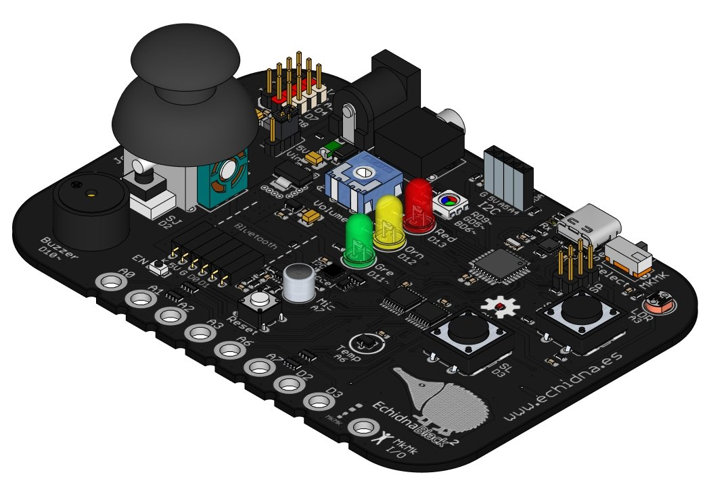
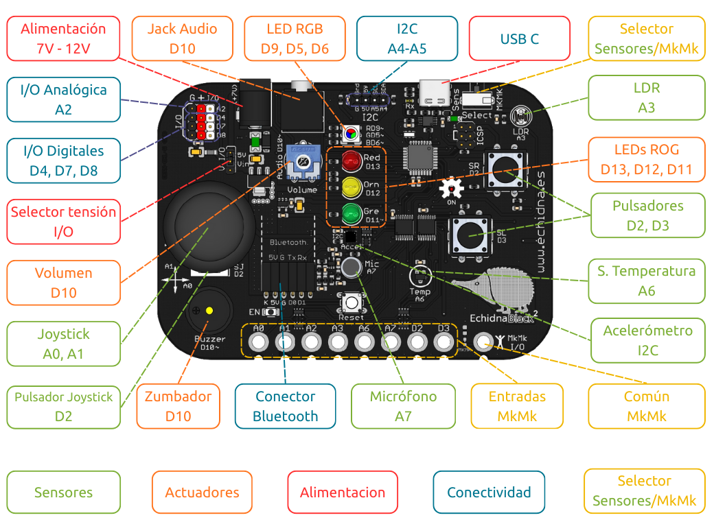

# 1. Introducción

**EchidnaBlack2** es una **placa** con diversos componentes integrados (LED, pulsadores, zumbador, sensores...) pensada para aprender los fundamentos de la **programación** y la **robótica**. Su objetivo es fomentar el **pensamiento computacional** en Primaria, Secundaria, Bachillerato y F.P., y estimular la creatividad con proyectos prácticos que conectan el mundo digital y el analógico.

{ width="330" }

Su microcontrolador es un **ATmega328P**, el mismo que el de **Arduino Nano**, así que podemos programarla con **Arduino IDE** escribiendo código en **C/C++**.

Te proponemos una serie de **proyectos sencillos** para dar tus primeros pasos. Cada proyecto presenta un componente de la placa y la instrucción de Arduino que lo controla.

Si quieres ampliar información, consulta el [Manual de EchidnaML y EchidnaBlack](https://echidnaeducacion.github.io/manual/) y la web del proyecto: [www.echidna.es](https://echidna.es/).

## Instalar Arduino IDE

**Arduino IDE** es el programa en el que escribimos el código y desde el que lo cargamos en la placa. Es gratuito y funciona en GNU/Linux, Windows y macOS.

1. Descarga la última versión de **Arduino IDE 2** desde la página oficial: [www.arduino.cc/en/software](https://www.arduino.cc/en/software/). Elige la descarga para tu sistema operativo.
2. Instálalo como cualquier otro programa. Si necesitas ayuda, consulta la [guía de instalación de Arduino](https://docs.arduino.cc/software/ide-v2/tutorials/getting-started-ide-v2/).
3. Abre Arduino IDE. La primera vez puede tardar un poco porque descarga algunos componentes.

IMAGEN ENTORNO ARDUINO IDE

La placa se comunica con el ordenador mediante el chip **CH340**. En GNU/Linux no hace falta instalar nada; en Windows y macOS, si el ordenador no reconoce la placa al conectarla, instala su controlador (driver). Encontrarás los enlaces de descarga en las [preguntas frecuentes del manual](https://echidnaeducacion.github.io/manual/09-preguntas-frecuentes/).

En GNU/Linux, si Arduino IDE no puede acceder al puerto de la placa, da permiso a tu usuario desde una terminal con `sudo usermod -a -G dialout $USER` y vuelve a iniciar sesión.

## Conectar la placa

Conecta la EchidnaBlack2 al ordenador con el cable **USB-C** y abre Arduino IDE. Antes de cargar un programa tienes que decirle al IDE **qué placa** vas a programar y **a qué puerto** está conectada. En el menú **Herramientas** elige:

* **Placa:** Arduino AVR Boards → **Arduino Nano**.
* **Procesador:** **ATmega328P (Old Bootloader)**.
* **Puerto:** el puerto USB al que está conectada la placa. Su nombre depende del sistema operativo y el número puede variar según los dispositivos que tengas conectados:
    * GNU/Linux: `/dev/ttyUSB0`
    * Windows: `COM3`
    * macOS: `/dev/cu.usbserial-1410`

IMAGEN PLACA, PROCESADOR Y PUERTO

Si eliges otro procesador (por ejemplo, ATmega328P sin «Old Bootloader»), el programa no se cargará en la placa y el IDE mostrará un error.

## Estructura de un programa

Un programa de Arduino se llama **sketch** y siempre tiene, como mínimo, dos **funciones**: `setup()` y `loop()`. Es lo que aparece cuando creas un programa nuevo en Arduino IDE:

```arduino linenums="1"
// aquí van las constantes y las variables

void setup() {
  // se ejecuta una sola vez, al encender la placa
}

void loop() {
  // se repite una y otra vez, para siempre
}
```

* **Antes de `setup()`**: declaramos las **constantes** (como los pines de los componentes) y las **variables** que usará el programa.
* **`setup()`**: se ejecuta **una sola vez**, al encender la placa o al cargar el programa. La usamos para preparar la placa, por ejemplo, para indicar qué pines son entradas y cuáles salidas.
* **`loop()`**: se ejecuta **una y otra vez**, de forma infinita, mientras la placa tenga alimentación. Aquí va lo que queremos que la placa haga continuamente: leer sensores, encender LED, hacer sonar el zumbador...

Al escribir código, ten en cuenta estas reglas:

* Cada instrucción termina con **punto y coma** (`;`).
* Las **llaves** (`{` y `}`) marcan dónde empieza y dónde termina cada bloque de instrucciones, como el contenido de `setup()` o de `loop()`.
* Arduino distingue entre **mayúsculas y minúsculas**: `digitalWrite` funciona, pero `digitalwrite` da error.
* Lo que va detrás de `//` es un **comentario**: sirve para explicar el programa a las personas que lo leen y la placa no lo ejecuta.

## Cargar un programa en la placa

Con la placa conectada y elegidos la placa, el procesador y el puerto, ya puedes cargar tu programa:

1. **Escribe el código** en el editor de Arduino IDE (o cópialo del proyecto).
2. **Guárdalo** con **Archivo → Guardar**. Arduino IDE guarda cada programa en una carpeta con su mismo nombre.
3. Pulsa el botón **Verificar** (el de la marca de verificación, arriba a la izquierda). El IDE comprueba que el código está bien escrito y lo **compila**, es decir, lo traduce a instrucciones que entiende el microcontrolador. Si hay algún error, lo verás en la parte inferior de la ventana, indicando la línea en la que está.
4. Pulsa el botón **Subir** (el de la flecha, junto al anterior). El IDE vuelve a compilar el programa y lo **carga** en la placa. Al terminar, la parte inferior de la ventana indica que la carga se ha completado.

IMAGEN BOTONES VERIFICAR Y SUBIR

En cuanto termina la carga, la placa empieza a ejecutar el programa. El programa queda guardado en la placa: aunque la desconectes, cuando vuelvas a alimentarla seguirá funcionando hasta que cargues otro.

Si la carga falla, revisa que:

* La placa está conectada y has elegido el **puerto** correcto.
* Has elegido la placa **Arduino Nano** con el procesador **ATmega328P (Old Bootloader)**.
* No hay otro programa usando el puerto, como EchidnaML.

**¡ATENCIÓN!** Al cargar un programa desde Arduino IDE se borra el programa **StandardFirmata** que necesita EchidnaML para comunicarse con la placa. Si después quieres volver a usar la placa con EchidnaML, tendrás que instalarlo de nuevo, como se explica en el [manual](https://echidnaeducacion.github.io/manual/06-firmata/02-instalar-standardfirmata/).

## Pines de la EchidnaBlack2

Cada componente de la placa está conectado a un **pin** del microcontrolador. En los programas usaremos estos números para indicar con qué componente queremos trabajar. No hace falta que los memorices: en la placa, cada componente lleva **serigrafiado** al lado su número de pin (por ejemplo, `Red D13` junto al LED rojo o `Temp A6` junto al sensor de temperatura). Los pines marcados con el símbolo `~` admiten **PWM**.



Estos son los pines de los componentes que usaremos en los proyectos:

| Componente | Pin | Tipo |
|---|---|---|
| LED rojo | D13 | Digital |
| LED naranja | D12 | Digital |
| LED verde | D11 | Digital |
| LED RGB: rojo / verde / azul | D9 / D5 / D6 | Digital/Analógico |
| Zumbador | D10 | Digital/Analógico |
| Pulsador SR (derecho) | D2 | Digital |
| Pulsador SL (izquierdo) | D3 | Digital |
| Joystick: eje X / eje Y | A0 / A1 | Analógico |
| Sensor de luz (LDR) | A3 | Analógico |
| Sensor de temperatura | A6 | Analógico |
| Micrófono | A7 | Analógico |
| Acelerómetro | I2C: A4 (SDA) / A5 (SCL) | Digital |
| Entradas MkMk analógicas | A0, A1, A2, A3, A6, A7 | Analógico |
| Entradas MkMk digitales | D2, D3 | Digital |

* **Digital**: solo trabaja con dos valores, encendido o apagado (`HIGH` o `LOW`).
* **Analógico**: lee valores intermedios, entre `0` y `1023`, como la cantidad de luz o la posición del joystick.
* **Digital/Analógico**: es un pin digital que, además, puede dar valores intermedios, entre `0` y `255`, por **PWM** (modulación por ancho de pulso). Así podemos regular el brillo del LED RGB o hacer sonar el zumbador.

En el código, los pines digitales se escriben solo con su número (`13`) y los analógicos con la letra A (`A3`).

Las **entradas MkMk** (modo Makey Makey) comparten pin con otros componentes de la placa. Para usarlas hay que poner el selector del modo de funcionamiento en **MkMk**.
