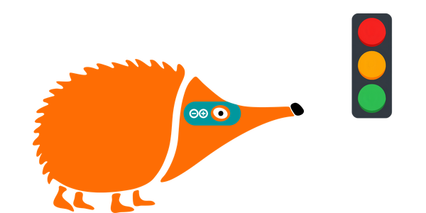
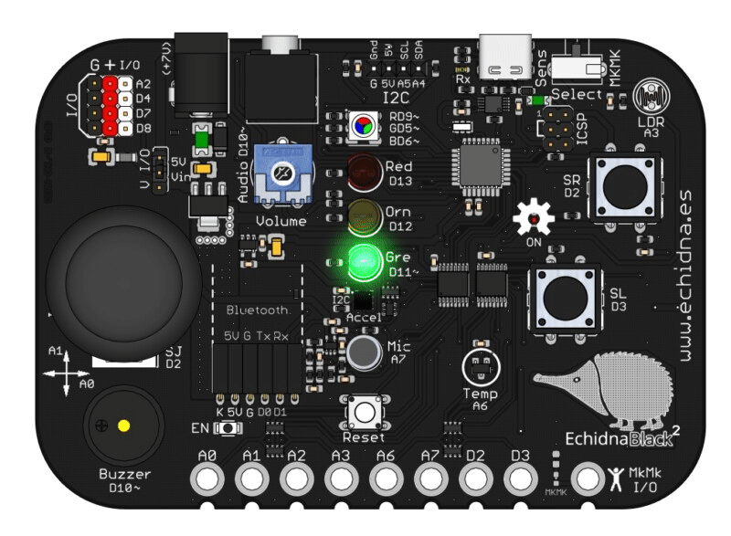

# 2.2 Semáforo

{ .img-cabecera }

## 1. Qué vamos a hacer

Vamos a realizar un semáforo en el que el LED verde se enciende durante 5 segundos, luego se enciende el LED naranja durante 2 segundos y finalmente el LED rojo durante 5 segundos. El ciclo se repite continuamente.



### 1.1 Qué vamos a aprender

* A diseñar **secuencias temporizadas** (eventos que ocurren en un orden y tiempo exactos).
* A controlar múltiples componentes digitales (LED) de forma coordinada.
* A estructurar un ciclo de estados infinito (**programación cíclica**).

### 1.2 Qué vamos a usar

#### Componentes

* **LED verde (pin 11):** Fase de paso.
* **LED naranja (pin 12):** Fase de precaución.
* **LED rojo (pin 13):** Fase de detención.

{ .img-lupa }

#### Programación

Para encender y apagar los LED ya conoces `digitalWrite` y para esperar, `delay`. Antes de usar un pin hay que decirle a la placa cómo lo vamos a usar con la función `pinMode(pin, modo)`:

* **pin**: el número del pin que queremos configurar.
* **modo**: `OUTPUT` si es una **salida** (la placa envía señales por él, como a un LED) o `INPUT` si es una **entrada** (la placa lee señales por él, como de un pulsador; lo veremos en el próximo proyecto).

## 2. Programamos

La programación se basa en una secuencia cíclica donde cada LED permanece encendido durante un tiempo específico y luego pasa al siguiente estado de forma automática.

Escribe el siguiente código en Arduino IDE y cárgalo en la placa:

```arduino linenums="1"
// Semáforo: verde 5 s, naranja 2 s y rojo 5 s

const int ledVerde = 11;    // LED verde conectado al pin 11
const int ledNaranja = 12;  // LED naranja conectado al pin 12
const int ledRojo = 13;     // LED rojo conectado al pin 13

void setup() {
  // los pines de los tres LED son salidas
  pinMode(ledVerde, OUTPUT);
  pinMode(ledNaranja, OUTPUT);
  pinMode(ledRojo, OUTPUT);
}

void loop() {
  // fase verde: 5 segundos
  digitalWrite(ledVerde, HIGH);
  delay(5000);
  digitalWrite(ledVerde, LOW);

  // fase naranja: 2 segundos
  digitalWrite(ledNaranja, HIGH);
  delay(2000);
  digitalWrite(ledNaranja, LOW);

  // fase roja: 5 segundos
  digitalWrite(ledRojo, HIGH);
  delay(5000);
  digitalWrite(ledRojo, LOW);
}
```

**Cómo funciona**:

**Las constantes** (líneas 3 a 5): guardan el pin de cada LED, para usar en el programa nombres como `ledVerde` en lugar de números.

**La función `setup()`** (líneas 7 a 12): con `pinMode` indicamos que los pines de los tres LED son **salidas**. Cada pin que usemos necesita su propio `pinMode`.

**La función `loop()`** (líneas 14 a 29): repite para siempre las tres fases del semáforo:

1. El LED verde se enciende durante 5 segundos (`delay(5000)`). Al finalizar este tiempo, se apaga.
2. El LED naranja se enciende durante 2 segundos, y luego se apaga.
3. El LED rojo se enciende durante 5 segundos. Transcurrido este tiempo, se apaga.

Luego, el ciclo vuelve a comenzar con la luz verde y se repite de forma indefinida.

## 3. Mejóralo

Prueba a perfeccionar tu semáforo con algunas de estas tres mejoras que te proponemos:

1. **Naranja intermitente:** Modifica la fase intermedia para que el LED naranja no se quede fijo, sino que **parpadee 3 veces rápidas** (encendido `0.3` segundos / apagado `0.3` segundos) antes de pasar al rojo.

    **Pista:** puedes copiar tres veces el encendido y el apagado del LED naranja o, mejor, usar un bucle `for`, que repite las instrucciones de su interior el número de veces que le indiquemos: `for (int i = 0; i < 3; i++) { ... }` las repite 3 veces.

    **Ayuda:** solo cambia la función `loop()`:

    ```arduino
    void loop() {
      // fase verde: 5 segundos
      digitalWrite(ledVerde, HIGH);
      delay(5000);
      digitalWrite(ledVerde, LOW);

      // fase naranja: 3 parpadeos rápidos
      for (int i = 0; i < 3; i++) {
        digitalWrite(ledNaranja, HIGH);
        delay(300);
        digitalWrite(ledNaranja, LOW);
        delay(300);
      }

      // fase roja: 5 segundos
      digitalWrite(ledRojo, HIGH);
      delay(5000);
      digitalWrite(ledRojo, LOW);
    }
    ```

2. **Semáforo de peatones:** Usa el **LED RGB** de la placa como semáforo de peatones: debe estar en **rojo** mientras los coches tienen el verde o el naranja, y en **verde** cuando los coches tienen el rojo.

    **Pista:** el LED RGB tiene un LED rojo (pin `9`) y uno verde (pin `5`) que se encienden y se apagan con `digitalWrite`, como los demás. Declara una constante para cada uno y configúralos como salidas.

    **Ayuda:**

    ```arduino linenums="1"
    // Semáforo con semáforo de peatones en el LED RGB

    const int ledVerde = 11;    // LED verde conectado al pin 11
    const int ledNaranja = 12;  // LED naranja conectado al pin 12
    const int ledRojo = 13;     // LED rojo conectado al pin 13
    const int peatonRojo = 9;   // rojo del LED RGB conectado al pin 9
    const int peatonVerde = 5;  // verde del LED RGB conectado al pin 5

    void setup() {
      pinMode(ledVerde, OUTPUT);
      pinMode(ledNaranja, OUTPUT);
      pinMode(ledRojo, OUTPUT);
      pinMode(peatonRojo, OUTPUT);
      pinMode(peatonVerde, OUTPUT);
    }

    void loop() {
      // coches en verde: peatones en rojo
      digitalWrite(peatonRojo, HIGH);
      digitalWrite(ledVerde, HIGH);
      delay(5000);
      digitalWrite(ledVerde, LOW);

      // coches en naranja: peatones siguen en rojo
      digitalWrite(ledNaranja, HIGH);
      delay(2000);
      digitalWrite(ledNaranja, LOW);

      // coches en rojo: peatones en verde
      digitalWrite(peatonRojo, LOW);
      digitalWrite(peatonVerde, HIGH);
      digitalWrite(ledRojo, HIGH);
      delay(5000);
      digitalWrite(ledRojo, LOW);
      digitalWrite(peatonVerde, LOW);
    }
    ```

3. **Semáforo sonoro adaptado:** Añade el **zumbador** de la placa para avisar a personas con discapacidad visual:
    * **Fase verde:** Sonido intermitente lento.
    * **Fase roja:** Silencio.

    **Pista:** el zumbador está en el pin `10`. `analogWrite(zumbador, 125)` lo hace sonar y `analogWrite(zumbador, 0)` lo apaga. Para el sonido intermitente, usa un bucle `for` que repita 5 veces: sonar 0,5 segundos y callar 0,5 segundos (5 × 1 s = los 5 segundos de la fase verde).

    **Ayuda:**

    ```arduino linenums="1"
    // Semáforo sonoro: pitidos lentos en verde y silencio en rojo

    const int ledVerde = 11;    // LED verde conectado al pin 11
    const int ledNaranja = 12;  // LED naranja conectado al pin 12
    const int ledRojo = 13;     // LED rojo conectado al pin 13
    const int zumbador = 10;    // zumbador conectado al pin 10

    void setup() {
      pinMode(ledVerde, OUTPUT);
      pinMode(ledNaranja, OUTPUT);
      pinMode(ledRojo, OUTPUT);
      pinMode(zumbador, OUTPUT);
    }

    void loop() {
      // fase verde: 5 pitidos lentos (5 segundos)
      digitalWrite(ledVerde, HIGH);
      for (int i = 0; i < 5; i++) {
        analogWrite(zumbador, 125);  // suena
        delay(500);
        analogWrite(zumbador, 0);    // calla
        delay(500);
      }
      digitalWrite(ledVerde, LOW);

      // fase naranja: 2 segundos
      digitalWrite(ledNaranja, HIGH);
      delay(2000);
      digitalWrite(ledNaranja, LOW);

      // fase roja: 5 segundos en silencio
      digitalWrite(ledRojo, HIGH);
      delay(5000);
      digitalWrite(ledRojo, LOW);
    }
    ```
