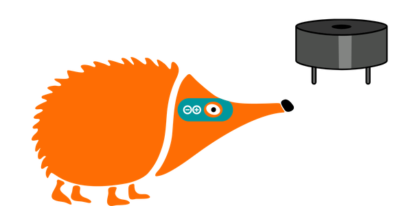
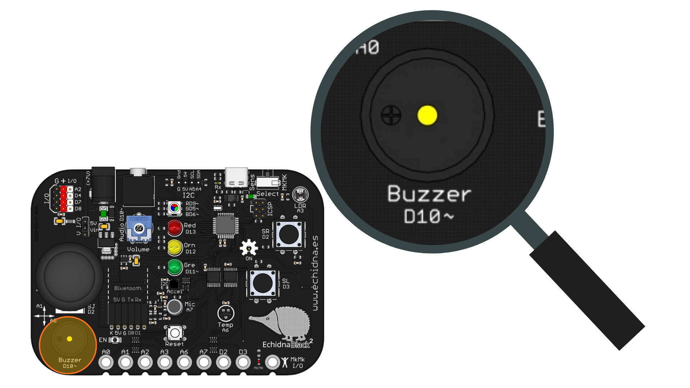

# 2.4 Timbre

{ .img-cabecera }

## 1. Qué vamos a hacer

Vamos a programar un timbre eléctrico: el **zumbador** emitirá un sonido únicamente mientras mantengamos presionado el **pulsador izquierdo (SL)**, y se callará en cuanto lo soltemos.

### 1.1 Qué vamos a aprender

* A controlar un actuador de sonido (**zumbador**) mediante un pulsador.
* A evaluar estados en tiempo real (pulsado o sin pulsar).
* A usar el condicional **`if ... else`** para que el zumbador suene solo mientras el pulsador está presionado.
* A **modular** el valor de una salida mediante **PWM** con la función `analogWrite`.

### 1.2 Qué vamos a usar

#### Componentes

* **Pulsador SL (Switch Left / Izquierdo, pin 3):** Componente de entrada para activar el sonido.
* **Zumbador pasivo (Buzzer, pin 10):** Componente de salida que genera pitidos.

{ .img-lupa }

#### Programación

Para hacer sonar el zumbador usamos la función `analogWrite(pin, valor)`:

* **pin**: el número del pin del zumbador, el `10`.
* **valor**: un número entre `0` y `255`. Con `125` el zumbador suena y con `0` se calla.

El zumbador de la placa es **pasivo**: no suena con una salida digital (`digitalWrite`), porque necesita una señal que se encienda y se apague muy rápido para hacerlo vibrar. Esa señal es la **PWM** (modulación por ancho de pulso), y por eso el zumbador está en un pin de tipo **Digital/Analógico** (ver la tabla de pines de la [Introducción](../01-introduccion.md)) y lo controlamos con `analogWrite`. El volumen se ajusta con el potenciómetro **Volume** de la placa.

## 2. Programamos

El programa revisa continuamente si el pulsador SL está presionado: si lo está, el zumbador suena y, si no, se calla.

Escribe el siguiente código en Arduino IDE y cárgalo en la placa:

```arduino linenums="1"
// Timbre: el zumbador suena mientras pulsamos SL

const int pulsadorSL = 3;  // pulsador izquierdo conectado al pin 3
const int zumbador = 10;   // zumbador conectado al pin 10

int estadoSL = LOW;  // guarda si SL está pulsado (HIGH) o no (LOW)

void setup() {
  pinMode(pulsadorSL, INPUT);  // el pulsador es una entrada
  pinMode(zumbador, OUTPUT);   // el zumbador es una salida
}

void loop() {
  // lee el estado del pulsador
  estadoSL = digitalRead(pulsadorSL);

  if (estadoSL == HIGH) {
    analogWrite(zumbador, 125);  // SL pulsado: el zumbador suena
  } else {
    analogWrite(zumbador, 0);    // SL sin pulsar: el zumbador se calla
  }
}
```

**Cómo funciona**:

**Las constantes** (líneas 3 y 4): guardan los pines del pulsador SL y del zumbador.

**La variable** (línea 6): `estadoSL` guarda lo que leemos en el pulsador: `HIGH` si está pulsado y `LOW` si no lo está.

**La función `setup()`** (líneas 8 a 11): configura el pin del pulsador como **entrada** (`INPUT`) y el del zumbador como **salida** (`OUTPUT`).

**La función `loop()`** (líneas 13 a 22): lee el pulsador con `digitalRead` y guarda el resultado en `estadoSL`. Después, con `if ... else`, decide qué hacer. A diferencia del proyecto anterior, aquí **las dos ramas** hacen algo: una enciende el zumbador y la otra lo apaga. El programa revisa continuamente:

```
SI el pulsador SL está presionado:
    --> El zumbador suena.

SI NO (es decir, si SL está sin pulsar):
    --> El zumbador se calla.
```

De esta forma, el zumbador solo suena mientras mantenemos el pulsador presionado.

## 3. Mejóralo

Prueba a realizar algunas de las siguientes modificaciones al proyecto:

1. **LED testigo:** Añade dos LED que indiquen el estado del timbre: el **LED verde** encendido mientras el zumbador suena y el **LED rojo** encendido mientras está en silencio.

    **Pista:** declara las constantes del LED rojo (pin `13`) y del LED verde (pin `11`), configúralos como salidas y, en cada rama del `if ... else`, cambia los dos LED con `digitalWrite`.

    **Ayuda:** además de las constantes y los `pinMode` de los LED, cambia la función `loop()`:

    ```arduino
    void loop() {
      estadoSL = digitalRead(pulsadorSL);

      if (estadoSL == HIGH) {
        analogWrite(zumbador, 125);    // suena
        digitalWrite(ledVerde, HIGH);  // verde encendido
        digitalWrite(ledRojo, LOW);    // rojo apagado
      } else {
        analogWrite(zumbador, 0);      // silencio
        digitalWrite(ledVerde, LOW);   // verde apagado
        digitalWrite(ledRojo, HIGH);   // rojo encendido
      }
    }
    ```

2. **Alarma intermitente:** Modifica el programa para que, al mantener pulsado **SL**, el sonido no sea continuo, sino que emita pitidos intermitentes tipo alarma: `100` milisegundos de sonido y `100` milisegundos de silencio.

    **Pista:** dentro del `if`, haz sonar el zumbador, espera con `delay(100)`, apágalo y vuelve a esperar con `delay(100)`.

    **Ayuda:** cambia el `if` de la función `loop()`:

    ```arduino
      if (estadoSL == HIGH) {
        analogWrite(zumbador, 125);  // pitido
        delay(100);
        analogWrite(zumbador, 0);    // silencio
        delay(100);
      } else {
        analogWrite(zumbador, 0);    // SL sin pulsar: silencio
      }
    ```

3. **Timbre de dos tonos:** Programa el pulsador **SR** para que emita un tono más **agudo** que el pulsador **SL**. ¡Intenta combinar pulsaciones cortas y largas para enviar mensajes secretos en código Morse a tus compañeros!

    **Pista:** con `analogWrite` el zumbador siempre suena con el mismo tono. Para elegir el tono usa la función `tone(pin, frecuencia)`, donde la **frecuencia** se indica en hercios (Hz): cuanto mayor es, más agudo es el sonido (por ejemplo, `440` para SL y `880` para SR). Para que deje de sonar, usa `noTone(pin)`.

    **Ayuda:** esta mejora cambia varias partes del programa, así que te dejamos una posible solución:

    ```arduino linenums="1"
    // Timbre de dos tonos: SL suena grave y SR, agudo

    const int pulsadorSR = 2;  // pulsador derecho conectado al pin 2
    const int pulsadorSL = 3;  // pulsador izquierdo conectado al pin 3
    const int zumbador = 10;   // zumbador conectado al pin 10

    const int tonoGrave = 440;  // frecuencia del tono de SL, en Hz
    const int tonoAgudo = 880;  // frecuencia del tono de SR, en Hz

    int estadoSR = LOW;  // guarda si SR está pulsado (HIGH) o no (LOW)
    int estadoSL = LOW;  // guarda si SL está pulsado (HIGH) o no (LOW)

    void setup() {
      pinMode(pulsadorSR, INPUT);
      pinMode(pulsadorSL, INPUT);
      pinMode(zumbador, OUTPUT);
    }

    void loop() {
      estadoSR = digitalRead(pulsadorSR);
      estadoSL = digitalRead(pulsadorSL);

      if (estadoSL == HIGH) {
        tone(zumbador, tonoGrave);  // SL pulsado: tono grave
      } else {
        if (estadoSR == HIGH) {
          tone(zumbador, tonoAgudo);  // SR pulsado: tono agudo
        } else {
          noTone(zumbador);  // ninguno pulsado: silencio
        }
      }
    }
    ```

    La función **`tone`** genera en el pin una señal que se enciende y se apaga tantas veces por segundo como indique la frecuencia, y esa frecuencia es la que marca el tono del zumbador. Como en el proyecto anterior, usamos un `if` dentro del `else`: si SL está pulsado suena el tono grave; si no, comprobamos SR para hacer sonar el agudo y, si no hay ninguno pulsado, `noTone` apaga el zumbador.
