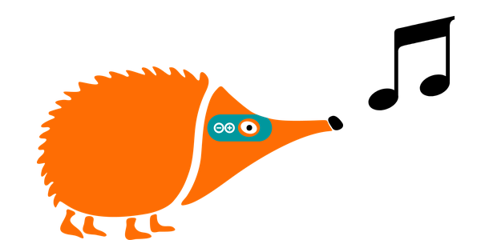
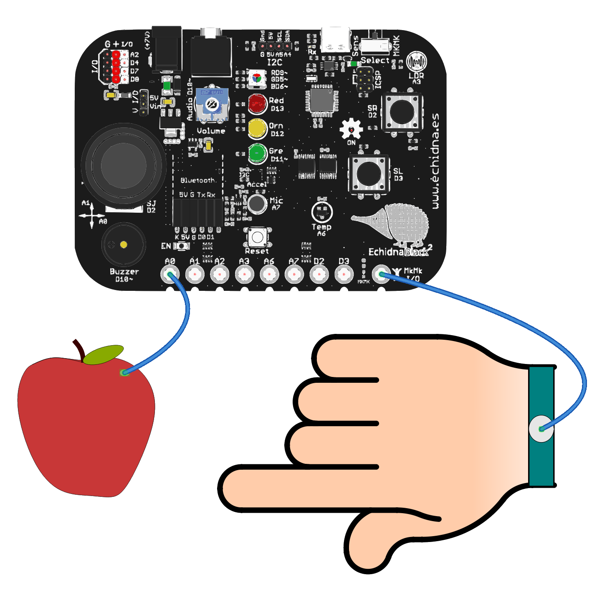

# 2.7 Piano de frutas

{ .img-cabecera }

## 1. Qué vamos a hacer

Vamos a convertir la entrada **MkMk A0** de nuestra placa en una tecla de piano táctil. Cada vez que toques la entrada (o un objeto conductor conectado a ella, como una fruta), el **zumbador** de la placa tocará una nota musical.

### 1.1 Qué vamos a aprender

* A detectar la conductividad eléctrica de objetos cotidianos usando el **modo Makey Makey (MkMk)**.
* A conectar cables de cocodrilo en los conectores externos de la placa.
* A entender cómo funciona un **circuito cerrado** a través de nuestro propio cuerpo.
* A tocar **notas musicales** con el zumbador, indicando su **frecuencia** y su **duración**.

### 1.2 Qué vamos a usar

#### Componentes

* **Entrada MkMk A0 (pin A0):** Conector táctil para detectar contacto o conductividad.
* **Conector común MkMk I/O (5V):** Indispensable para cerrar el circuito con tu cuerpo. Está en el extremo derecho de la fila de conectores y proporciona 5V.
* **Cables de cocodrilo:** Para conectar objetos externos (frutas, plastilina, papel de aluminio, etc.).
* **Zumbador pasivo (pin 10):** Toca la nota musical.

**¡ATENCIÓN!** Para que funcione el modo MkMk debemos poner el selector del modo de funcionamiento hacia la derecha, y se nos encenderá el LED testigo en la parte inferior.



En la imagen, la fruta está conectada a la entrada **A0** y la pulsera al conector común **MkMk I/O** (5V). Al tocar la fruta con la mano, una corriente muy pequeña pasa a través de tu cuerpo, el circuito se cierra y la placa lo detecta en la entrada A0.

#### Programación

La entrada A0 es **analógica** (ver la tabla de pines de la [Introducción](../01-introduccion.md)), así que la leemos con `analogRead`, como el sensor de luz. Si el valor supera **350** (en una escala de `0` a `1023`), el circuito está cerrado: hay contacto.

Para tocar la nota usamos la función `tone(pin, frecuencia, duración)`:

* **pin**: el número del pin del zumbador, el `10`.
* **frecuencia**: la nota que suena, en hercios (Hz). Cuanto mayor es, más aguda es la nota. El **Do central** del piano son `262` Hz.
* **duración**: el tiempo que suena la nota, en milisegundos. Pasado ese tiempo, el zumbador se calla solo.

## 2. Programamos

El programa revisa continuamente la entrada MkMk A0: **cuando detecta contacto**, el zumbador toca la nota **Do central** durante **250 milisegundos** (un cuarto de segundo).

Escribe el siguiente código en Arduino IDE y cárgalo en la placa:

```arduino linenums="1"
// Piano de frutas: al tocar la fruta conectada a A0 suena la nota Do

const int entradaMkMk = A0;  // entrada MkMk conectada al pin A0
const int zumbador = 10;     // zumbador conectado al pin 10

const int umbral = 350;    // por encima de este valor hay contacto
const int notaDo = 262;    // frecuencia de la nota Do central, en Hz
const int duracion = 250;  // duración de la nota, en milisegundos

int valorMkMk = 0;  // guarda el valor que lee la entrada (de 0 a 1023)

void setup() {
  pinMode(zumbador, OUTPUT);  // el zumbador es una salida
}

void loop() {
  // lee la entrada MkMk
  valorMkMk = analogRead(entradaMkMk);

  if (valorMkMk > umbral) {
    tone(zumbador, notaDo, duracion);  // hay contacto: suena la nota Do
    delay(duracion);                   // espera a que termine la nota
  }
}
```

**Cómo funciona**:

**Las constantes** (líneas 3 a 8): guardan los pines de la entrada MkMk y del zumbador, el **umbral** que indica si hay contacto, y la **frecuencia** y la **duración** de la nota.

**La variable** (línea 10): `valorMkMk` guarda el valor que leemos en la entrada A0, un número entre `0` y `1023`.

**La función `setup()`** (líneas 12 a 14): configura el pin del zumbador como **salida** (`OUTPUT`). La entrada A0 no necesita `pinMode`, porque es un pin analógico.

**La función `loop()`** (líneas 16 a 25): lee la entrada con `analogRead` y la compara con el umbral. El operador `>` («mayor que») comprueba si `valorMkMk` es más grande que `umbral`. Si hay contacto, `tone` toca la nota Do y `delay` espera a que termine antes de volver a leer la entrada. El programa revisa continuamente:

```
SI la entrada MkMk A0 detecta contacto (valor mayor que 350):
    --> Suena la nota Do central durante 250 milisegundos.
```

Aquí no hay `else`: si no hay contacto, no ocurre nada y el programa vuelve a comprobar la entrada. Si mantienes la mano en la fruta, la nota se repite una y otra vez.

## 3. Mejóralo

Prueba a realizar algunas de las siguientes modificaciones al proyecto:

1. **Luz y sonido:** Haz que el **LED verde** se encienda mientras suena la nota y se apague al terminar.

    **Pista:** declara la constante del LED verde (pin `11`) y configúralo como salida. Dentro del `if`, enciéndelo con `digitalWrite` antes de `tone` y apágalo después del `delay`.

    **Ayuda:** además de la constante y el `pinMode` del LED verde, cambia el `if` de la función `loop()`:

    ```arduino
      if (valorMkMk > umbral) {
        digitalWrite(ledVerde, HIGH);      // enciende el LED
        tone(zumbador, notaDo, duracion);  // suena la nota Do
        delay(duracion);                   // espera a que termine la nota
        digitalWrite(ledVerde, LOW);       // apaga el LED
      }
    ```

2. **Escala musical:** Conecta más frutas a las entradas **A1, A2 y A3** con otros cables de cocodrilo y crea un mini teclado de cuatro teclas: **Do** (`262` Hz), **Re** (`294` Hz), **Mi** (`330` Hz) y **Fa** (`349` Hz).

    **Pista:** declara una constante para cada entrada y para cada nota, y escribe un `if` por tecla. Puedes poner `analogRead` directamente dentro de la condición: `if (analogRead(teclaRe) > umbral)`.

    **Ayuda:** esta mejora cambia varias partes del programa, así que te dejamos una posible solución:

    ```arduino linenums="1"
    // Escala musical: cuatro teclas MkMk tocan Do, Re, Mi y Fa

    const int teclaDo = A0;   // tecla Do en la entrada MkMk A0
    const int teclaRe = A1;   // tecla Re en la entrada MkMk A1
    const int teclaMi = A2;   // tecla Mi en la entrada MkMk A2
    const int teclaFa = A3;   // tecla Fa en la entrada MkMk A3
    const int zumbador = 10;  // zumbador conectado al pin 10

    const int umbral = 350;    // por encima de este valor hay contacto
    const int notaDo = 262;    // frecuencias de las notas, en Hz
    const int notaRe = 294;
    const int notaMi = 330;
    const int notaFa = 349;
    const int duracion = 250;  // duración de cada nota, en milisegundos

    void setup() {
      pinMode(zumbador, OUTPUT);  // el zumbador es una salida
    }

    void loop() {
      if (analogRead(teclaDo) > umbral) {
        tone(zumbador, notaDo, duracion);  // tecla Do
        delay(duracion);
      }
      if (analogRead(teclaRe) > umbral) {
        tone(zumbador, notaRe, duracion);  // tecla Re
        delay(duracion);
      }
      if (analogRead(teclaMi) > umbral) {
        tone(zumbador, notaMi, duracion);  // tecla Mi
        delay(duracion);
      }
      if (analogRead(teclaFa) > umbral) {
        tone(zumbador, notaFa, duracion);  // tecla Fa
        delay(duracion);
      }
    }
    ```

    Los cuatro `if` van uno detrás de otro, sin `else`: en cada vuelta de `loop()` el programa comprueba las cuatro teclas y toca la nota de la que estés tocando.

3. **Teclado de colores:** Añade a tu escala el **LED RGB** para que cada tecla lo encienda de un color distinto: **Do** en rojo, **Re** en verde, **Mi** en azul y **Fa** en blanco.

    **Pista:** recuerda que el LED RGB tiene el rojo en el pin `9`, el verde en el `5` y el azul en el `6`, y que con los tres encendidos se ve blanco. En cada `if`, enciende el color antes de tocar la nota y, al final de `loop()`, apaga los tres colores.

    **Ayuda:** esta mejora es más compleja, así que te dejamos una posible solución:

    ```arduino linenums="1"
    // Teclado de colores: cada tecla MkMk toca una nota y enciende un color

    const int teclaDo = A0;   // tecla Do en la entrada MkMk A0
    const int teclaRe = A1;   // tecla Re en la entrada MkMk A1
    const int teclaMi = A2;   // tecla Mi en la entrada MkMk A2
    const int teclaFa = A3;   // tecla Fa en la entrada MkMk A3
    const int zumbador = 10;  // zumbador conectado al pin 10
    const int rgbRojo = 9;    // LED RGB: color rojo en el pin 9
    const int rgbVerde = 5;   // LED RGB: color verde en el pin 5
    const int rgbAzul = 6;    // LED RGB: color azul en el pin 6

    const int umbral = 350;    // por encima de este valor hay contacto
    const int notaDo = 262;    // frecuencias de las notas, en Hz
    const int notaRe = 294;
    const int notaMi = 330;
    const int notaFa = 349;
    const int duracion = 250;  // duración de cada nota, en milisegundos

    void setup() {
      pinMode(zumbador, OUTPUT);
      pinMode(rgbRojo, OUTPUT);
      pinMode(rgbVerde, OUTPUT);
      pinMode(rgbAzul, OUTPUT);
    }

    void loop() {
      if (analogRead(teclaDo) > umbral) {
        digitalWrite(rgbRojo, HIGH);  // Do: rojo
        tone(zumbador, notaDo, duracion);
        delay(duracion);
      }
      if (analogRead(teclaRe) > umbral) {
        digitalWrite(rgbVerde, HIGH);  // Re: verde
        tone(zumbador, notaRe, duracion);
        delay(duracion);
      }
      if (analogRead(teclaMi) > umbral) {
        digitalWrite(rgbAzul, HIGH);  // Mi: azul
        tone(zumbador, notaMi, duracion);
        delay(duracion);
      }
      if (analogRead(teclaFa) > umbral) {
        digitalWrite(rgbRojo, HIGH);  // Fa: blanco (los tres colores)
        digitalWrite(rgbVerde, HIGH);
        digitalWrite(rgbAzul, HIGH);
        tone(zumbador, notaFa, duracion);
        delay(duracion);
      }

      // apaga el LED RGB hasta la siguiente nota
      digitalWrite(rgbRojo, LOW);
      digitalWrite(rgbVerde, LOW);
      digitalWrite(rgbAzul, LOW);
    }
    ```

    Cada `if` enciende su color, toca su nota y espera a que termine. Al final de `loop()` apagamos los tres colores, así el LED RGB solo está encendido mientras suena una nota. Si mantienes la mano en una fruta, el LED se apaga y se vuelve a encender tan rápido que lo verás siempre encendido.
