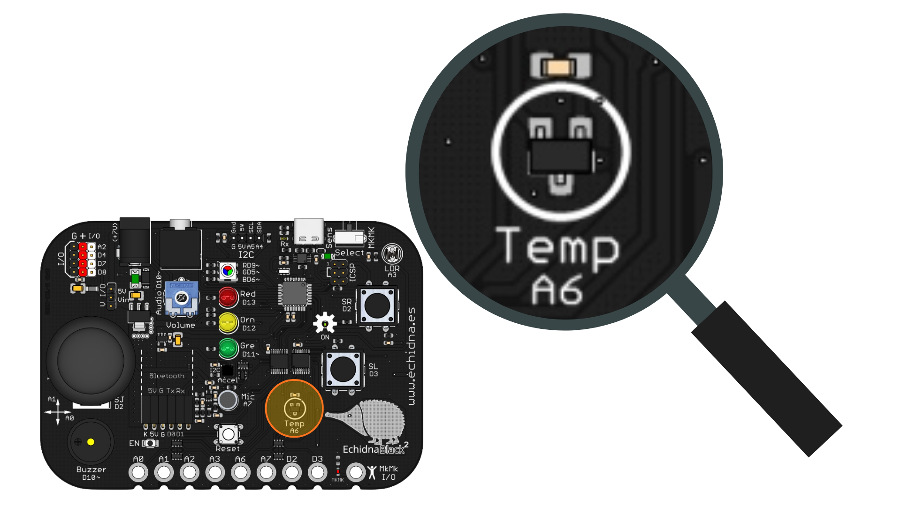

# 2.8 El echidna dice la temperatura

{ .img-cabecera }

## 1. Qué vamos a hacer

Vamos a convertir a nuestra placa en un **hombre del tiempo**: cada segundo medirá la **temperatura** con su sensor y nos la dirá en el **Monitor serie** de Arduino IDE con una frase como «Hola, ahora hace una temperatura de 23.75 ºC».

### 1.1 Qué vamos a aprender

* A utilizar el **sensor de temperatura** para medir la temperatura ambiente en **grados Celsius** (ºC).
* A convertir la lectura de un sensor en una magnitud real mediante una **fórmula**.
* A guardar números con **decimales** en variables de tipo `float`.
* A enviar mensajes de la placa al ordenador y verlos en el **Monitor serie**.

### 1.2 Qué vamos a usar

* **Sensor de temperatura (pin A6):** Mide la temperatura del ambiente. Entrega un voltaje que depende de la temperatura.

{ .img-lupa }

El sensor está en un pin **analógico** (ver la tabla de pines de la [Introducción](../01-introduccion.md)), así que lo leemos con `analogRead`, que nos da un número entre `0` y `1023`. Para pasar ese número a grados Celsius usamos esta fórmula, ajustada a la EchidnaBlack2:

```
temperatura = (lectura × 0.4658) − 50
```

Para que la placa nos diga la temperatura, usamos el **Monitor serie**: una ventana de Arduino IDE donde vemos los mensajes que la placa envía al ordenador por el cable USB. Para enviar los mensajes usamos la función `Serial.print(dato)`:

* **dato**: lo que queremos mostrar. Puede ser un **texto**, entre comillas (`"Hola"`), o el valor de una **variable** (`temperatura`).
* `Serial.println(dato)` hace lo mismo, pero después **salta a la línea siguiente**, así cada mensaje empieza en una línea nueva.

Antes de enviar mensajes hay que abrir la comunicación en `setup()` con `Serial.begin(9600)`, donde `9600` es la **velocidad** en baudios.

## 2. Programamos

El programa lee el sensor de temperatura, convierte la lectura a grados Celsius y escribe en el Monitor serie una frase formada por tres partes: el texto «Hola, ahora hace una temperatura de », el valor de la temperatura y el símbolo «ºC». Después espera un segundo y vuelve a empezar.

Escribe el siguiente código en Arduino IDE y cárgalo en la placa:

```arduino linenums="1"
// Echidna dice la temperatura: muestra la temperatura en el Monitor serie

const int sensorTemperatura = A6;  // sensor de temperatura conectado al pin A6

int lectura = 0;          // guarda el valor que lee el sensor (de 0 a 1023)
float temperatura = 0.0;  // guarda la temperatura en grados Celsius, con decimales

void setup() {
  Serial.begin(9600);  // abre la comunicación con el ordenador a 9600 baudios
}

void loop() {
  // lee el sensor y convierte el valor a grados Celsius
  lectura = analogRead(sensorTemperatura);
  temperatura = (lectura * 0.4658) - 50.0;  // conversión ajustada a EchidnaBlack2

  // escribe la frase en el Monitor serie
  Serial.print("Hola, ahora hace una temperatura de ");
  Serial.print(temperatura);
  Serial.println(" ºC");

  delay(1000);  // espera 1 segundo hasta la siguiente medida
}
```

Después de cargar el programa, abre el **Monitor serie** desde el menú **Herramientas > Monitor Serie** y comprueba que la velocidad está en **9600 baudios**. Verás aparecer una frase nueva cada segundo.

IMAGEN MONITOR SERIE

**Cómo funciona**:

**La constante** (línea 3): guarda el pin del sensor de temperatura.

**Las variables** (líneas 5 y 6): `lectura` guarda el número que da el sensor, entre `0` y `1023`; es de tipo `int`, que solo admite números **enteros**. `temperatura` guarda los grados Celsius y es de tipo **`float`**, que admite números con **decimales** (por ejemplo, `23.75`). En el código, los decimales se escriben con **punto**, no con coma.

**La función `setup()`** (líneas 8 a 10): abre la comunicación con el ordenador con `Serial.begin(9600)`. El sensor no necesita `pinMode`, porque está en un pin analógico.

**La función `loop()`** (líneas 12 a 23): lee el sensor con `analogRead` y aplica la fórmula para obtener la temperatura. En el código, el signo de multiplicar es el asterisco (`*`). Después escribe la frase en tres partes: los dos primeros `Serial.print` escriben el texto y el valor seguidos, en la misma línea, y el `Serial.println` final añade « ºC» y salta de línea. El programa repite continuamente:

```
Lee la temperatura del sensor.
--> Escribe en el Monitor serie la frase con la temperatura.
--> Espera 1 segundo.
```

Para probarlo, calienta el sensor tocándolo suavemente con el dedo y observa cómo sube la temperatura.

## 3. Mejóralo

Prueba a realizar algunas de las siguientes modificaciones al proyecto:

1. **Como la tecla t:** En EchidnaML, el echidna dice la temperatura al pulsar la tecla **t**. Haz que la placa diga la temperatura solo cuando pulses el **pulsador SR**.

    **Pista:** declara la constante del pulsador SR (pin `2`) y configúralo como entrada. En `loop()`, mete todo lo que había dentro de un `if` que compruebe si SR está pulsado: `if (digitalRead(pulsadorSR) == HIGH)`.

    **Ayuda:** además de la constante y el `pinMode` del pulsador, cambia la función `loop()`:

    ```arduino
    void loop() {
      if (digitalRead(pulsadorSR) == HIGH) {
        // SR pulsado: mide y dice la temperatura
        lectura = analogRead(sensorTemperatura);
        temperatura = (lectura * 0.4658) - 50.0;

        Serial.print("Hola, ahora hace una temperatura de ");
        Serial.print(temperatura);
        Serial.println(" ºC");

        delay(1000);  // espera 1 segundo para no repetir la frase
      }
    }
    ```

2. **Grados Fahrenheit:** Añade el **pulsador SL** para que, al pulsarlo, la placa diga la temperatura en **grados Fahrenheit** (ºF). Con SR seguirá diciéndola en grados Celsius.

    **Pista:** para pasar de grados Celsius a Fahrenheit, multiplica por `1.8` y suma `32`. Guarda el resultado en una nueva variable `float` llamada `fahrenheit` y añade un segundo `if` para el pulsador SL (pin `3`).

    **Ayuda:** declara la constante del pulsador SL y la variable `fahrenheit`, configura SL como entrada y cambia la función `loop()`:

    ```arduino
    void loop() {
      // mide la temperatura en las dos escalas
      lectura = analogRead(sensorTemperatura);
      temperatura = (lectura * 0.4658) - 50.0;
      fahrenheit = temperatura * 1.8 + 32;

      if (digitalRead(pulsadorSR) == HIGH) {
        // SR pulsado: temperatura en grados Celsius
        Serial.print("Hola, ahora hace una temperatura de ");
        Serial.print(temperatura);
        Serial.println(" ºC");
        delay(1000);
      }

      if (digitalRead(pulsadorSL) == HIGH) {
        // SL pulsado: temperatura en grados Fahrenheit
        Serial.print("Hola, ahora hace una temperatura de ");
        Serial.print(fahrenheit);
        Serial.println(" ºF");
        delay(1000);
      }
    }
    ```

3. **Frío o calor:** Partiendo del programa original, haz que el **LED rojo** se encienda cuando la temperatura supere un valor (por ejemplo, `28` ºC) y que, si no lo supera, se encienda el **LED verde**. Para probarlo, calienta el sensor tocándolo suavemente con el dedo.

    **Pista:** declara las constantes del LED rojo (pin `13`) y del LED verde (pin `11`) y configúralos como salidas. Guarda el valor límite en una constante `float` llamada `umbral` y compáralo con la temperatura con `if ... else`, como en el interruptor crepuscular.

    **Ayuda:** esta mejora cambia varias partes del programa, así que te dejamos una posible solución:

    ```arduino linenums="1"
    // Frío o calor: el LED rojo avisa cuando la temperatura supera el umbral

    const int sensorTemperatura = A6;  // sensor de temperatura conectado al pin A6
    const int ledRojo = 13;            // LED rojo conectado al pin 13
    const int ledVerde = 11;           // LED verde conectado al pin 11

    const float umbral = 28.0;  // por encima de esta temperatura hace calor

    int lectura = 0;          // guarda el valor que lee el sensor (de 0 a 1023)
    float temperatura = 0.0;  // guarda la temperatura en grados Celsius, con decimales

    void setup() {
      Serial.begin(9600);
      pinMode(ledRojo, OUTPUT);
      pinMode(ledVerde, OUTPUT);
    }

    void loop() {
      lectura = analogRead(sensorTemperatura);
      temperatura = (lectura * 0.4658) - 50.0;

      Serial.print("Hola, ahora hace una temperatura de ");
      Serial.print(temperatura);
      Serial.println(" ºC");

      if (temperatura > umbral) {
        digitalWrite(ledRojo, HIGH);  // calor: LED rojo
        digitalWrite(ledVerde, LOW);
      } else {
        digitalWrite(ledRojo, LOW);   // sin calor: LED verde
        digitalWrite(ledVerde, HIGH);
      }

      delay(1000);  // espera 1 segundo hasta la siguiente medida
    }
    ```

    El umbral es de tipo `float` porque lo comparamos con la temperatura, que tiene decimales. Si en tu aula hace más calor o más frío, cambia el valor de `umbral` para que el LED rojo se encienda solo al calentar el sensor con el dedo.
