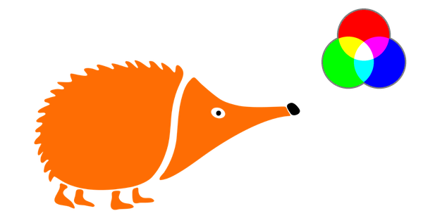
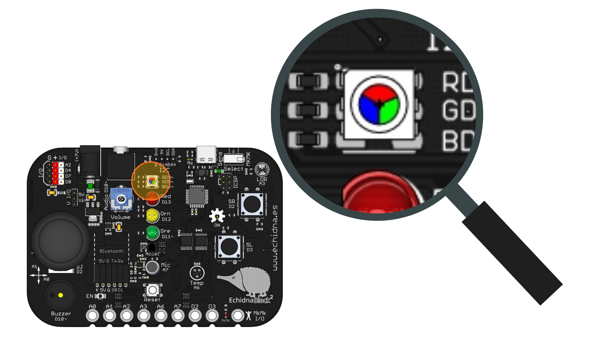

# 2.9 Mezclamos colores

{ .img-cabecera }

## 1. Qué vamos a hacer

Vamos a hacer que el **LED RGB** de la placa recorra, uno detrás de otro, un montón de colores distintos mezclando sus tres colores básicos: **rojo**, **verde** y **azul**. A la vez, veremos en el **Monitor serie** la mezcla que forma cada color.

### 1.1 Qué vamos a aprender

* A utilizar el **LED RGB** y a **mezclar** sus tres colores (rojo, verde y azul) para conseguir otros.
* A ajustar la **intensidad** de cada color con valores de `0` a `255` mediante **PWM** con `analogWrite`.
* A repetir instrucciones un número de veces con el bucle **`for`**.
* A poner un bucle **dentro de otro** (bucles **anidados**) para recorrer todas las combinaciones.

### 1.2 Qué vamos a usar

* **LED RGB (pines 9, 5 y 6):** Componente que tiene dentro tres LED: uno **rojo** (R, *Red*, pin 9), uno **verde** (G, *Green*, pin 5) y uno **azul** (B, *Blue*, pin 6). Al mezclar la luz de los tres podemos conseguir más de 16 millones de colores.

{ .img-lupa }

Los pines del LED RGB son de tipo **Digital/Analógico** (ver la tabla de pines de la [Introducción](../01-introduccion.md)), así que con `analogWrite` damos a cada color un valor entre `0` (apagado) y `255` (máxima intensidad). Por ejemplo, el **naranja Echidna** es mucho rojo (`254`), algo de verde (`109`) y casi nada de azul (`4`).

Para recorrer los valores de cada color usamos el bucle `for`, que repite las instrucciones que tiene entre llaves `{ }`:

```arduino
for (int rojo = 0; rojo <= 255; rojo = rojo + paso) {
  // instrucciones que se repiten
}
```

Entre los paréntesis tiene tres partes, separadas por punto y coma:

* **Inicio** (`int rojo = 0`): crea la variable que cuenta las vueltas y le da su primer valor.
* **Condición** (`rojo <= 255`): el bucle se repite mientras se cumpla. El operador `<=` significa «menor o igual que».
* **Incremento** (`rojo = rojo + paso`): cómo cambia la variable al final de cada vuelta; aquí, suma `paso`.

## 2. Programamos

El programa usa tres bucles `for`, uno dentro de otro: uno para el rojo, otro para el verde y otro para el azul. Cada color toma los valores `0`, `51`, `102`, `153`, `204` y `255`, y el programa prueba **todas las combinaciones**: 6 × 6 × 6 = **216 colores**. Cada color se ve durante una décima de segundo, así que la vuelta completa dura unos 22 segundos.

Escribe el siguiente código en Arduino IDE y cárgalo en la placa:

```arduino linenums="1"
// Mezclamos colores: recorre los colores del LED RGB con tres bucles for anidados

const int rgbRojo = 9;   // LED RGB: color rojo en el pin 9
const int rgbVerde = 5;  // LED RGB: color verde en el pin 5
const int rgbAzul = 6;   // LED RGB: color azul en el pin 6

const int paso = 51;     // cuánto sube cada color en cada vuelta (0, 51, 102, 153, 204, 255)
const int espera = 100;  // tiempo que se ve cada color, en milisegundos

void setup() {
  pinMode(rgbRojo, OUTPUT);  // los tres colores del LED RGB son salidas
  pinMode(rgbVerde, OUTPUT);
  pinMode(rgbAzul, OUTPUT);
  Serial.begin(9600);        // para ver en el Monitor serie la mezcla de cada color
}

void loop() {
  for (int rojo = 0; rojo <= 255; rojo = rojo + paso) {
    for (int verde = 0; verde <= 255; verde = verde + paso) {
      for (int azul = 0; azul <= 255; azul = azul + paso) {
        // mezcla los tres colores
        analogWrite(rgbRojo, rojo);
        analogWrite(rgbVerde, verde);
        analogWrite(rgbAzul, azul);

        // muestra la mezcla en el Monitor serie
        Serial.print(rojo);
        Serial.print("  ");
        Serial.print(verde);
        Serial.print("  ");
        Serial.println(azul);

        delay(espera);
      }
    }
  }
}
```

Después de cargar el programa, abre el **Monitor serie** (**Herramientas > Monitor Serie**, a **9600 baudios**) para ver los valores de rojo, verde y azul de cada color.

**Cómo funciona**:

**Las constantes** (líneas 3 a 8): guardan los pines de los tres colores del LED RGB, el **paso** (cuánto sube cada color de una vuelta a la siguiente) y la **espera** (cuánto tiempo se ve cada color).

**La función `setup()`** (líneas 10 a 15): configura los tres pines del LED RGB como **salidas** y abre la comunicación con el ordenador con `Serial.begin(9600)`.

**La función `loop()`** (líneas 17 a 37): tiene los tres bucles `for` anidados. Las variables `rojo`, `verde` y `azul` se crean dentro de cada `for` y cuentan los valores de cada color. Dentro del bucle más interior, `analogWrite` enciende cada color con su valor, `Serial.print` escribe la mezcla en el Monitor serie y `delay` deja ver el color.

Los bucles anidados funcionan como el cuentakilómetros de un coche: el bucle de **dentro** (el azul) es el que gira más rápido. Cada vez que el azul termina sus seis valores, el verde sube un paso; y cada vez que el verde termina los suyos, sube el rojo:

```
PARA cada valor del rojo (0, 51, ... 255):
    PARA cada valor del verde (0, 51, ... 255):
        PARA cada valor del azul (0, 51, ... 255):
            --> Enciende el LED RGB con esa mezcla.
            --> Escribe la mezcla en el Monitor serie.
            --> Espera 100 milisegundos.
```

Cuando los tres bucles terminan, `loop()` vuelve a empezar y el recorrido de colores se repite.

## 3. Mejóralo

Prueba a realizar algunas de las siguientes modificaciones al proyecto:

1. **Más colores:** Cambia las constantes del programa para que el LED RGB recorra **muchos más colores** y comprueba cuánto dura ahora la vuelta completa.

    **Pista:** cuanto más pequeño sea `paso`, más valores toma cada color y más combinaciones hay. Para que cada color llegue justo a `255`, elige un paso que divida exactamente a `255`, como `85`, `51`, `17`, `15` o `5`. Si hay muchos colores, baja también la `espera` para que la vuelta no dure demasiado.

    **Ayuda:** cambia solo las dos constantes:

    ```arduino
    const int paso = 15;    // 18 valores por color: 0, 15, 30... 255
    const int espera = 10;  // cada color se ve 10 milisegundos
    ```

    Ahora cada color toma 18 valores: 18 × 18 × 18 = **5832 colores**, y la vuelta completa dura aproximadamente un minuto.

2. **Respiración:** Haz que **un solo color**, por ejemplo el azul, se encienda poco a poco hasta su máximo brillo y después se apague poco a poco, como si el LED respirara.

    **Pista:** usa dos bucles `for` seguidos (no anidados): el primero sube el azul de `0` a `255` y el segundo lo baja de `255` a `0`. Para bajar, la condición es `azul >= 0` («mayor o igual que») y el incremento resta: `azul = azul - paso`. Usa un paso pequeño (`5`) y una espera corta (`30`) para que el cambio sea suave.

    **Ayuda:** cambia las constantes `paso` y `espera` y la función `loop()`:

    ```arduino
    const int paso = 5;     // el azul sube y baja de 5 en 5
    const int espera = 30;  // tiempo entre un brillo y el siguiente, en milisegundos
    ```

    ```arduino
    void loop() {
      // el azul se enciende poco a poco
      for (int azul = 0; azul <= 255; azul = azul + paso) {
        analogWrite(rgbAzul, azul);
        delay(espera);
      }

      // el azul se apaga poco a poco
      for (int azul = 255; azul >= 0; azul = azul - paso) {
        analogWrite(rgbAzul, azul);
        delay(espera);
      }
    }
    ```

3. **Termómetro de colores:** Usa el **sensor de temperatura** para que el LED RGB cambie de color según la temperatura: **azul** si hace frío (menos de `20` ºC), **verde** si la temperatura es agradable y **rojo** si hace calor (más de `28` ºC).

    **Pista:** lee la temperatura como en el proyecto [El echidna dice la temperatura](08-echidna-dice-temperatura.md) y usa `if`, `else if` y `else`, como en el medidor de luz del [Interruptor crepuscular](06-interruptor-crepuscular.md). Para cada color, da `255` al que quieres encender y `0` a los otros dos con `analogWrite`.

    **Ayuda:** esta mejora es más compleja, así que te dejamos una posible solución:

    ```arduino linenums="1"
    // Termómetro de colores: el LED RGB cambia de color según la temperatura

    const int sensorTemperatura = A6;  // sensor de temperatura conectado al pin A6
    const int rgbRojo = 9;             // LED RGB: color rojo en el pin 9
    const int rgbVerde = 5;            // LED RGB: color verde en el pin 5
    const int rgbAzul = 6;             // LED RGB: color azul en el pin 6

    const float umbralFrio = 20.0;   // por debajo de esta temperatura hace frío
    const float umbralCalor = 28.0;  // por encima de esta temperatura hace calor

    int lectura = 0;          // guarda el valor que lee el sensor (de 0 a 1023)
    float temperatura = 0.0;  // guarda la temperatura en grados Celsius, con decimales

    void setup() {
      pinMode(rgbRojo, OUTPUT);
      pinMode(rgbVerde, OUTPUT);
      pinMode(rgbAzul, OUTPUT);
      Serial.begin(9600);
    }

    void loop() {
      lectura = analogRead(sensorTemperatura);
      temperatura = (lectura * 0.4658) - 50.0;

      Serial.print("Temperatura: ");
      Serial.print(temperatura);
      Serial.println(" ºC");

      if (temperatura < umbralFrio) {
        // frío: azul
        analogWrite(rgbRojo, 0);
        analogWrite(rgbVerde, 0);
        analogWrite(rgbAzul, 255);
      } else if (temperatura > umbralCalor) {
        // calor: rojo
        analogWrite(rgbRojo, 255);
        analogWrite(rgbVerde, 0);
        analogWrite(rgbAzul, 0);
      } else {
        // temperatura agradable: verde
        analogWrite(rgbRojo, 0);
        analogWrite(rgbVerde, 255);
        analogWrite(rgbAzul, 0);
      }

      delay(1000);  // espera 1 segundo hasta la siguiente medida
    }
    ```

    El programa usa dos umbrales: si la temperatura está por debajo de `umbralFrio`, el LED se pone azul; si está por encima de `umbralCalor`, rojo; y si no se cumple ninguna de las dos condiciones, está entre los dos umbrales y se pone verde. Para probarlo, calienta el sensor tocándolo suavemente con el dedo y observa la temperatura en el Monitor serie; si hace falta, ajusta los umbrales a la temperatura de tu aula.
