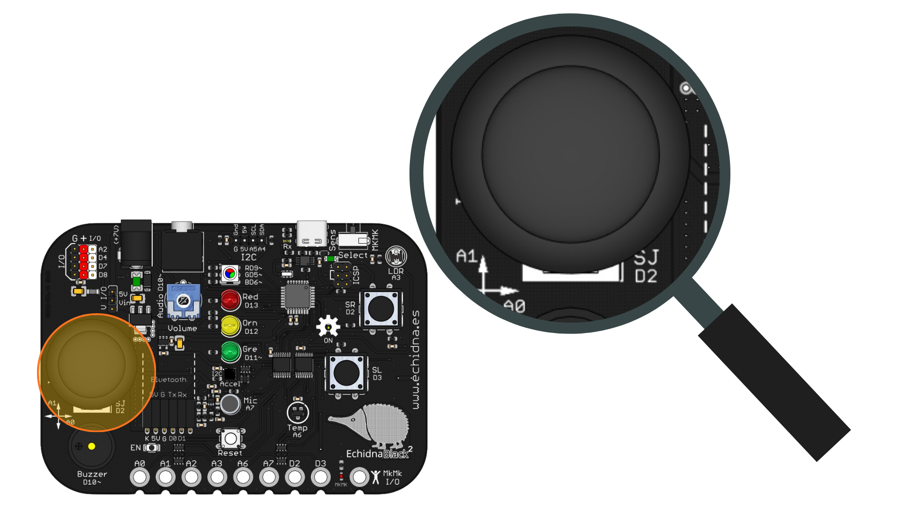

# 2.12 Regulador de luz con joystick

IMAGEN CABECERA JOYSTICK

## 1. Qué vamos a hacer

Vamos a usar el **joystick** como el regulador de luz de una lámpara: cuanto más lo alejemos del centro, hacia la izquierda o hacia la derecha, más brillará el **LED verde**. Con el joystick en el centro, el LED estará apagado.

### 1.1 Qué vamos a aprender

* Cómo funciona un **joystick**: dos potenciómetros, uno para cada eje, que leemos con `analogRead`.
* A convertir un rango de valores en otro con la función **`map`**, por ejemplo, la posición del joystick en un brillo.
* A repasar `analogWrite` y el condicional `if ... else if ... else`.

### 1.2 Qué vamos a usar

#### Componentes

* **Joystick (eje X en el pin A0 y eje Y en el pin A1):** Palanca que se mueve en dos direcciones. Por dentro tiene dos **potenciómetros**, uno por eje, que dan un valor según la posición de la palanca. En este proyecto usamos solo el eje X.
* **LED verde (pin 11):** Su brillo se regula con PWM, como en el proyecto [Brillo LED](05-brillo-led.md).

{ .img-lupa }

#### Programación

Los ejes del joystick están en pines **analógicos**, así que los leemos con `analogRead`. Con la palanca en reposo, los dos ejes dan valores en torno a `512`. El eje X baja hasta `0` a la **izquierda** y sube hasta `1023` a la **derecha**; el eje Y da `0` **abajo** y `1023` **arriba**.

El problema es que `analogWrite` necesita un brillo entre `0` y `255`. Para pasar de un rango a otro usamos la función `map(valor, desdeMin, desdeMax, hastaMin, hastaMax)`:

* **valor**: el número que queremos convertir, por ejemplo, la lectura del joystick.
* **desdeMin** y **desdeMax**: el rango en el que está ese número.
* **hastaMin** y **hastaMax**: el rango al que lo queremos llevar.

Por ejemplo, `map(valorX, 532, 1023, 0, 255)` convierte un valor entre `532` y `1023` en otro entre `0` y `255`: `532` da `0`, `1023` da `255` y los valores intermedios, lo que corresponda en proporción. Si en el primer rango ponemos los números **al revés**, `map(valorX, 492, 0, 0, 255)`, el rango se invierte: `492` da `0` y `0` da `255`.

## 2. Programamos

El programa lee el eje X del joystick. Si la palanca está en el centro (entre `492` y `532`), apaga el LED; si se ha movido a la izquierda o a la derecha, convierte su posición en un brillo con `map`: cuanto más lejos del centro, más brillo.

Escribe el siguiente código en Arduino IDE y cárgalo en la placa:

```arduino linenums="1"
// Regulador de luz: el LED verde brilla más cuanto más movemos el joystick

const int joystickX = A0;  // eje X del joystick en el pin A0
const int ledVerde = 11;   // LED verde conectado al pin 11

const int centroMin = 492;  // por debajo, el joystick está hacia la izquierda
const int centroMax = 532;  // por encima, hacia la derecha

int valorX = 0;  // guarda la posición del joystick en el eje X (de 0 a 1023)
int brillo = 0;  // guarda el brillo del LED (de 0 a 255)

void setup() {
  pinMode(ledVerde, OUTPUT);  // el LED es una salida
}

void loop() {
  // lee la posición del joystick
  valorX = analogRead(joystickX);

  if (valorX > centroMax) {
    // hacia la derecha: de 532 a 1023 pasa a 0 a 255
    brillo = map(valorX, centroMax, 1023, 0, 255);
  } else if (valorX < centroMin) {
    // hacia la izquierda: de 492 a 0 pasa a 0 a 255
    brillo = map(valorX, centroMin, 0, 0, 255);
  } else {
    brillo = 0;  // en el centro: apagado
  }

  analogWrite(ledVerde, brillo);  // enciende el LED con ese brillo
}
```

**Cómo funciona**:

**Las constantes** (líneas 3 a 7): guardan los pines del joystick y del LED, y los dos límites de la **zona del centro**, `centroMin` y `centroMax`, donde el LED está apagado.

**Las variables** (líneas 9 y 10): `valorX` guarda la posición del joystick y `brillo`, el brillo que le daremos al LED.

**La función `setup()`** (líneas 12 a 14): configura el pin del LED como **salida**. El joystick no necesita `pinMode`, porque está en un pin analógico.

**La función `loop()`** (líneas 16 a 31): lee el joystick y, con `if ... else if ... else`, decide el brillo:

```
SI el joystick da más de 532 (movido a la derecha):
    --> El brillo va de 0 (en 532) a 255 (en 1023).
SI NO, SI da menos de 492 (movido a la izquierda):
    --> El brillo va de 0 (en 492) a 255 (en 0).
SI NO (está en el centro):
    --> El brillo es 0.
```

La zona del centro, de `492` a `532`, evita que el LED se encienda un poco con el joystick suelto, porque la palanca nunca vuelve exactamente a `512`. Por último, `analogWrite` enciende el LED con el brillo calculado.

## 3. Mejóralo

Prueba a realizar algunas de las siguientes modificaciones al proyecto:

1. **Lee el joystick:** Mira qué valores dan los ejes X e Y del joystick de tu placa en reposo y al moverlo, y ajusta las constantes `centroMin` y `centroMax` si el LED se enciende un poco con el joystick suelto.

    **Pista:** envía los dos valores al ordenador y ábrelos con el **Serial Plotter**, como en la primera mejora del [Nivel de burbuja](11-nivel-de-burbuja.md): escribe `X:` antes del valor del eje X e `Y:` antes del valor del eje Y.

    **Ayuda:** este programa solo lee el joystick y envía los dos ejes al ordenador:

    ```arduino linenums="1"
    // Lee el joystick: dibuja los ejes X e Y en el Serial Plotter

    const int joystickX = A0;  // eje X del joystick en el pin A0
    const int joystickY = A1;  // eje Y del joystick en el pin A1

    int valorX = 0;  // guarda la posición del eje X
    int valorY = 0;  // guarda la posición del eje Y

    void setup() {
      Serial.begin(9600);  // abre la comunicación a 9600 baudios
    }

    void loop() {
      valorX = analogRead(joystickX);
      valorY = analogRead(joystickY);

      Serial.print("X:");      // nombre del eje X
      Serial.print(valorX);    // valor del eje X
      Serial.print(" Y:");     // nombre del eje Y
      Serial.println(valorY);  // valor del eje Y y salto de línea

      delay(100);  // diez medidas por segundo
    }
    ```

2. **Mando de colores:** Usa los dos ejes del joystick para mezclar colores en el **LED RGB**: el eje X controla el **rojo** y el eje Y, el **azul**. Con la palanca en el centro, el LED se verá morado, y al moverla cambiará la mezcla.

    **Pista:** lee los dos ejes y convierte cada uno, de `0` a `1023`, en una intensidad de `0` a `255` con `map`. El rojo del LED RGB está en el pin `9` y el azul, en el `6`.

    **Ayuda:** esta mejora cambia varias partes del programa, así que te dejamos una posible solución:

    ```arduino linenums="1"
    // Mando de colores: el eje X controla el rojo y el eje Y, el azul

    const int joystickX = A0;  // eje X del joystick en el pin A0
    const int joystickY = A1;  // eje Y del joystick en el pin A1
    const int rgbRojo = 9;     // LED RGB: color rojo en el pin 9
    const int rgbAzul = 6;     // LED RGB: color azul en el pin 6

    int valorX = 0;  // guarda la posición del eje X
    int valorY = 0;  // guarda la posición del eje Y
    int rojo = 0;    // intensidad del rojo (de 0 a 255)
    int azul = 0;    // intensidad del azul (de 0 a 255)

    void setup() {
      pinMode(rgbRojo, OUTPUT);
      pinMode(rgbAzul, OUTPUT);
    }

    void loop() {
      valorX = analogRead(joystickX);
      valorY = analogRead(joystickY);

      // cada eje, de 0 a 1023, pasa a una intensidad de 0 a 255
      rojo = map(valorX, 0, 1023, 0, 255);
      azul = map(valorY, 0, 1023, 0, 255);

      analogWrite(rgbRojo, rojo);
      analogWrite(rgbAzul, azul);
    }
    ```

3. **Theremín:** Convierte la placa en un **theremín**, un instrumento que se toca sin tocarlo: al mover el joystick, el **zumbador** cambia de nota, más grave hacia la izquierda y más aguda hacia la derecha. Con el joystick en el centro, silencio.

    **Pista:** convierte la posición del joystick en una frecuencia con `map`, por ejemplo, de `200` Hz a la izquierda a `1000` Hz a la derecha, y hazla sonar con `tone(zumbador, frecuencia)`. Para que no suene todo el rato, comprueba si el joystick está **fuera** del centro con `||` («o»), como en la alarma del [Nivel de burbuja](11-nivel-de-burbuja.md), y, si está en el centro, calla el zumbador con `noTone(zumbador)`.

    **Ayuda:** esta mejora es más compleja, así que te dejamos una posible solución:

    ```arduino linenums="1"
    // Theremín: el eje X del joystick elige la nota del zumbador

    const int joystickX = A0;  // eje X del joystick en el pin A0
    const int zumbador = 10;   // zumbador conectado al pin 10

    const int centroMin = 492;  // zona del centro: de 492...
    const int centroMax = 532;  // ...a 532

    const int notaGrave = 200;   // frecuencia a la izquierda, en Hz
    const int notaAguda = 1000;  // frecuencia a la derecha, en Hz

    int valorX = 0;      // guarda la posición del joystick en el eje X
    int frecuencia = 0;  // guarda la nota que suena, en Hz

    void setup() {
      pinMode(zumbador, OUTPUT);
    }

    void loop() {
      valorX = analogRead(joystickX);

      if (valorX < centroMin || valorX > centroMax) {
        // fuera del centro: suena una nota según la posición
        frecuencia = map(valorX, 0, 1023, notaGrave, notaAguda);
        tone(zumbador, frecuencia);
      } else {
        noTone(zumbador);  // en el centro: silencio
      }
    }
    ```

    Como `tone` sigue sonando hasta que llamamos a `noTone`, la nota cambia en cuanto movemos el joystick, sin cortes.
