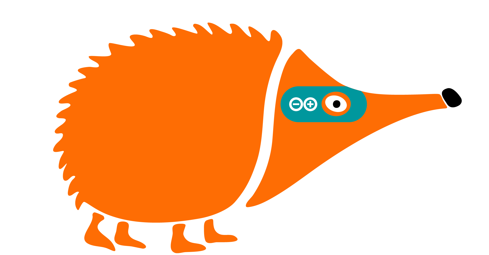

# Proyectos de inicio con Arduino

{ .img-portada }

Proyectos sencillos para iniciarse en la programación de la placa **EchidnaBlack2** con **Arduino IDE**, pensada para docentes y alumnado que dan sus primeros pasos con la placa.

[Descargar en PDF](proyectos-inicio-arduino.pdf){ .md-button .md-button--primary }

## 1. Introducción

Antes de empezar, lee la [Introducción](01-introduccion.md): qué es la EchidnaBlack2, cómo instalar Arduino IDE, cómo conectar la placa y cómo es un programa de Arduino.

## 2. Proyectos con Arduino

[Proyectos](02-arduino/index.md) para programar la placa en C/C++ con Arduino IDE, presentando un componente nuevo en cada uno:

1. [Hola Mundo](02-arduino/01-hola-mundo.md)
2. [Semáforo](02-arduino/02-semaforo.md)
3. [Interruptor de luz](02-arduino/03-interruptor-de-luz.md)
4. [Timbre](02-arduino/04-timbre.md)
5. [Brillo LED](02-arduino/05-brillo-led.md)
6. [Interruptor crepuscular](02-arduino/06-interruptor-crepuscular.md)
7. [Piano de frutas](02-arduino/07-piano-de-frutas.md)
8. [El echidna dice la temperatura](02-arduino/08-echidna-dice-temperatura.md)
9. [Mezclamos colores](02-arduino/09-mezclamos-colores.md)
10. [Vúmetro](02-arduino/10-vumetro.md)
11. [Regulador de luz con joystick](02-arduino/11-regulador-de-luz.md)
12. [Nivel de burbuja](02-arduino/12-nivel-de-burbuja.md)
13. [Control desde el ordenador](02-arduino/13-control-desde-el-ordenador.md)

## 3. Licencia

Estos proyectos se publican bajo licencia Creative Commons BY-SA 4.0. Consulta los detalles en la página de [Licencia](03-licencia.md).
